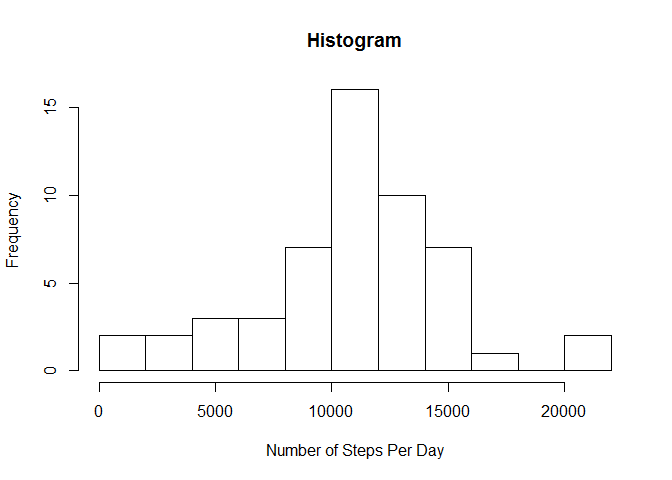
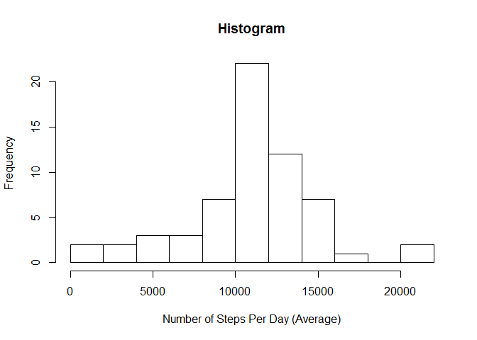

# Reproducible Research: Peer Assessment 1

## Loading required R packages to peform the analysis


```r
library(timeDate)
```

```
## Warning: package 'timeDate' was built under R version 3.2.3
```

```r
library(plyr)
```

```
## Warning: package 'plyr' was built under R version 3.2.2
```

```r
library(sqldf)
```

```
## Warning: package 'sqldf' was built under R version 3.2.2
```

```
## Loading required package: gsubfn
## Loading required package: proto
## Loading required package: RSQLite
## Loading required package: DBI
```

```r
library(lattice)
```

```
## Warning: package 'lattice' was built under R version 3.2.2
```

## Loading and preprocessing the data


```r
# downloading and unzipping the file in the working directory
dataUrl <- "http://d396qusza40orc.cloudfront.net/repdata%2Fdata%2Factivity.zip"
download.file(dataUrl, destfile = "data.zip", mode = "wb")
unzip("data.zip")
unlink("data.zip")
dateDownloaded <- date()
originalData <- read.csv("activity.csv", header=TRUE)


activity <- originalData
activity$date <- as.Date(activity$date)
activity$day <- as.factor(weekdays(activity$date))
activity$interval <- as.factor(activity$interval)
activity$week <- as.factor(ifelse(weekdays(activity$date) %in% c("Saturday","Sunday"), 'Weekend', 'Weekday'))

activity_NAomit <- na.omit(activity)
activity_NAomit_perDay <- ddply(activity_NAomit,.(date),summarise,steps=round(sum(steps),0))
activity_NAomit_perInterval <- ddply(activity_NAomit,.(interval),summarise,steps=round(mean(steps),2))
```


## What is mean total number of steps taken per day?

#### 1) The total number of steps per day (ignoring NAs) is:

```r
activity_NAomit_perDay
```

```
##          date steps
## 1  2012-10-02   126
## 2  2012-10-03 11352
## 3  2012-10-04 12116
## 4  2012-10-05 13294
## 5  2012-10-06 15420
## 6  2012-10-07 11015
## 7  2012-10-09 12811
## 8  2012-10-10  9900
## 9  2012-10-11 10304
## 10 2012-10-12 17382
## 11 2012-10-13 12426
## 12 2012-10-14 15098
## 13 2012-10-15 10139
## 14 2012-10-16 15084
## 15 2012-10-17 13452
## 16 2012-10-18 10056
## 17 2012-10-19 11829
## 18 2012-10-20 10395
## 19 2012-10-21  8821
## 20 2012-10-22 13460
## 21 2012-10-23  8918
## 22 2012-10-24  8355
## 23 2012-10-25  2492
## 24 2012-10-26  6778
## 25 2012-10-27 10119
## 26 2012-10-28 11458
## 27 2012-10-29  5018
## 28 2012-10-30  9819
## 29 2012-10-31 15414
## 30 2012-11-02 10600
## 31 2012-11-03 10571
## 32 2012-11-05 10439
## 33 2012-11-06  8334
## 34 2012-11-07 12883
## 35 2012-11-08  3219
## 36 2012-11-11 12608
## 37 2012-11-12 10765
## 38 2012-11-13  7336
## 39 2012-11-15    41
## 40 2012-11-16  5441
## 41 2012-11-17 14339
## 42 2012-11-18 15110
## 43 2012-11-19  8841
## 44 2012-11-20  4472
## 45 2012-11-21 12787
## 46 2012-11-22 20427
## 47 2012-11-23 21194
## 48 2012-11-24 14478
## 49 2012-11-25 11834
## 50 2012-11-26 11162
## 51 2012-11-27 13646
## 52 2012-11-28 10183
## 53 2012-11-29  7047
```


#### 2) Histogram of the total number of steps taken each day (ignoring NAs):

```r
hist(activity_NAomit_perDay$steps, breaks=15)
```

 


#### 3) The average mean and median of steps per day (ignoring NAs) is, respectively:

```r
mean(activity_NAomit_perDay$steps)
```

```
## [1] 10766.19
```


```r
median(activity_NAomit_perDay$steps)
```

```
## [1] 10765
```

## What is the average daily activity pattern?

#### 1) Time series plot of the average of steps per interval across all days.


```r
plot(as.numeric(activity_NAomit_perInterval$interval),activity_NAomit_perInterval$steps, type="l")
```

 

#### 2) The interval 835 scored the highest average of number of steps: 206.17.

```r
head(activity_NAomit_perInterval[order(-activity_NAomit_perInterval$steps),])
```

```
##     interval  steps
## 104      835 206.17
## 105      840 195.92
## 107      850 183.40
## 106      845 179.57
## 103      830 177.30
## 101      820 171.15
```


## Imputing missing values

#### 1) The total number of rows with missing values (NA) is 2304. The only variable with missing values is: steps.


```r
sum(is.na(activity))
```

```
## [1] 2304
```

```r
summary(activity)
```

```
##      steps             date               interval            day      
##  Min.   :  0.00   Min.   :2012-10-01   0      :   61   Friday   :2592  
##  1st Qu.:  0.00   1st Qu.:2012-10-16   5      :   61   Monday   :2592  
##  Median :  0.00   Median :2012-10-31   10     :   61   Saturday :2304  
##  Mean   : 37.38   Mean   :2012-10-31   15     :   61   Sunday   :2304  
##  3rd Qu.: 12.00   3rd Qu.:2012-11-15   20     :   61   Thursday :2592  
##  Max.   :806.00   Max.   :2012-11-30   25     :   61   Tuesday  :2592  
##  NA's   :2304                          (Other):17202   Wednesday:2592  
##       week      
##  Weekday:12960  
##  Weekend: 4608  
##                 
##                 
##                 
##                 
## 
```

#### 2) In order to adress the missing values issue in the steps variable I will use the average of steps of the interval given the week variable (considering it might be a difference in the pattern when is a weekday or weekend).

 * Estimate the average of steps by interval and weekend/weekday.
 * Create a variable "key" in the activity data in order to join datasets.
 * Run a for loop to fill in NA values. 


#### 3) Creating a new dataset activity_new


```r
activity_new <- activity

stepsFix <- ddply(activity_NAomit,.(interval,week),summarise,stepsMean=round(mean(steps),2))
stepsFix$key <- paste(stepsFix$interval,stepsFix$week,sep="")
stepsFix <- stepsFix[c(1,2,4,3)]

activity_new$key <- paste(activity_new$interval,activity_new$week,sep="")
activity_new$isNA <- is.na(activity_new$steps)
activity_new <- sqldf("SELECT activity_new.*, stepsFix.stepsMean FROM activity_new INNER JOIN stepsFix ON activity_new.key = stepsFix.key")
```

```
## Loading required package: tcltk
```

```r
for(i in 1:length(activity_new$steps)){ if(is.na(activity_new$steps[i])){   activity_new$steps[i] <- activity_new$stepsMean[i]}}

activity_new_perDay <- ddply(activity_new,.(date),summarise,steps=round(sum(steps),0))
activity_new_perInterval <- ddply(activity_new,.(interval),summarise,steps=round(mean(steps),2))
```

#### 4) After considering average of steps for the missing values the mean and median is sliglty different. In the first analyis the mean and median was nearly equal, however in this part they are more distant which also indicate a right skewed pattern (given the mean is higher than the median).


```r
hist(activity_new_perDay$steps, breaks=15)
```

 

```r
mean(activity_new_perDay$steps)
```

```
## [1] 10762.03
```

```r
median(activity_new_perDay$steps)
```

```
## [1] 10571
```


## Are there differences in activity patterns between weekdays and weekends?

#### 1) The factor Weekend/Weekday was created in the first task of the assigment.

#### 2) Panel comparing the average of steps pattern in Weekend and Weekday. 


```r
activity_perWeek <- ddply(activity_new,.(interval,week),summarise,stepsMean=round(mean(steps),2))
xyplot(stepsMean~interval|week, type="l", data=activity_perWeek, as.table=FALSE, layout = c(1, 2))
```

 

```r
#Weekend
sum(subset(activity_perWeek, activity_perWeek$week == "Weekend")$steps)
```

```
## [1] 12406.55
```

```r
#Weekday
sum(subset(activity_perWeek, activity_perWeek$week == "Weekday")$steps)
```

```
## [1] 10177.38
```


From the plot and the total sum of steps it's possible to deduct that:

 * The subject starts walking earlier on Weekdays.
 * The subject walks more on Weekends.


